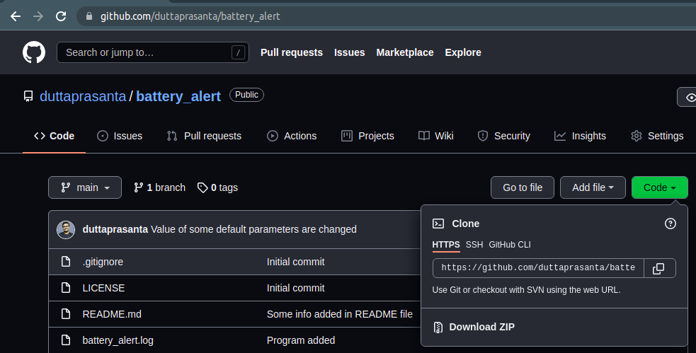
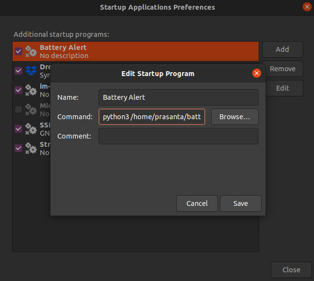
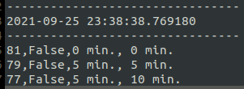

# Battery Alert
This program will maintain a log of battery percentage and notify users using text and voice notifications. 

# Motivation
In Ubuntu 20.04, I was not getting any low battery notifications. My laptop was shutting down suddenly without any alert. I tried to use many tweaks from the Internet though nothing worked perfectly. Annoyed with the problem, I have created *Battery Alert*, a simple lightweight and customizable application for measuring battery percentage after a specific time interval.     

# Features
1. Maintain a log file with battery percentage, charging status, duration after a specific percentage change in battery status.
2. Show a text alert when battery percentage is below a certain threshold and it is not charging.
3. Send a sound alert when the battery percentage is below a certain threshold and it is not charging.
4. Run on Windows and Linux (Not tested in Mac)

# Why to use?
1. If your laptop's battery is faulty and you want to measure battery capacity.
2. If you want to get notifications after a certain threshold of your laptop's battery.
3. If you want to keep track battery's charging time and discharging time.
4. If you want to keep track of the rate of discharging.
5. Something else

# How to use it?
> **Note: Here the program is tested in python3**

Go to your terminal and run it as simple as the following - 
```
python battery_alert.py
```
You can also customize the default parameters by doing the following -
```
python battery_alert.py --sleep_time=300 --log_percentage=1 --alert_percentage=20 --notification_alert=True --sound_alert=True 
```
All the parameters are shown above with default values. You can customize them as you want. 

# Installation

## Step 1 
Clone the repository by
```
git clone https://github.com/duttaprasanta/battery_alert.git
```
You may also download the zip file.



Then extract it.

## Step 2
### For Linux
```
sudo apt-get install libdbus-glib-1-dev libdbus-1-dev
pip install -r requirements_linux.txt
```
### For Windows
```
pip install -r requirements_windows.txt
```
If you face dependency conflicts, create a virtual environment and follow the above steps. 

## Step 3 (If you want to run the program at system startup)
### For Linux
Create an entry in the *Startup Application* app
```
python3 /home/<your_user_name>/battery_alert.py
```


# Parameters
1. **sleep_time** : (Datatype = Integer). Interval (in seconds) to check for battery percentage. This indicates how much time (in seconds) the application to sleep. E.g, `sleep_time=300` means the application will be activated after every 300 seconds (5 minutes).

2. **log_percentage** : (Datatype = Integer). Writes an entry in the log file after every *log_percentage* difference in battery status. E.g, `log_percentage=1` means the application will add an entry after every 1% of change in battery status.

3. **alert_percentage** : (Datatype : Integer). The application starts sending text and/or sound alerts after *alert_percentage*. E.g, `alert_percentage = 20` means, the application will send text and/or sound notifications when your laptop's battery has 20% of charge and it is not charging.

4. **notification_alert** : (Datatype : Boolean). Whether to enable or disable text notification. E.g, `notification_alert = True` means, the text notification is enabled. 

5. **sound_alert** : (Datatype : Boolean). Whether to enable or disable the sound notification. E.g, `sound_alert = True` means, the sound notification is enabled.

# Log file
When the program is executed, the current time and date will be added in the log file named *battery_alert.log*. This date and time are considered as *base time*. Then it adds a log entry after every *log_percentage* apart as discussed above. The log entry will have four comma-separated values- 
> battery percentage, Whether charging or not, Time between every entry, Total time from base time to the current entry



E.g, Here the base date and time is 25th September 2021 at 11:38 pm. The third entry describes after 10 minutes from base time and after 5 minutes from the previous entry, the battery percentage was 77% and it is not charging.

# License
GNU Affero General Public License v3.0. See [License](./LICENSE) for more information.

# Some useful links


# Support
If you like this repository, kindly star it and follow me.

# Want to contribute?
1. **Fork** this repository
2. Modify it
3. Create a **Pull request**